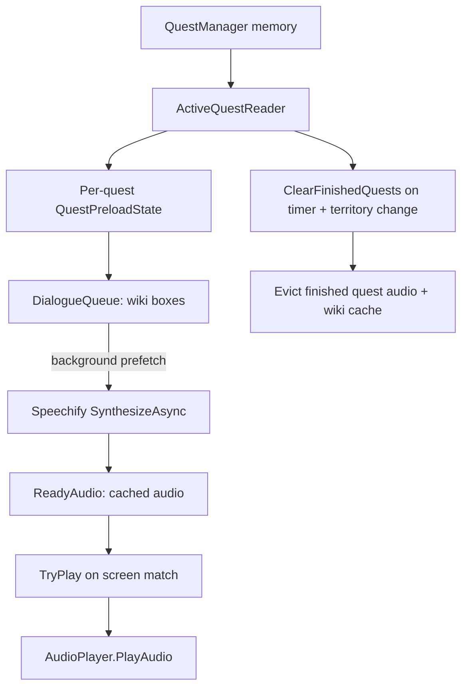

# FF14P2TTS — Zero-Latency Speechify Prefetch Architecture

This document is the single source of truth for how the plugin eliminates
Speechify latency by prefetching dialogue **before** it appears on screen.

## Goal

When NPC dialogue appears, play audio instantly. Do **not** block the game
thread waiting for the Speechify HTTP round-trip.

The idea is a **prefetch-and-cache** pipeline:

1. Read the player's active quests.
2. Fetch each quest's dialogue script from the wiki.
3. Parse the script into ordered dialogue boxes.
4. Synthesize each box with Speechify **in the background** and cache the audio.
5. When a line appears on screen, match it against the cache and play instantly.
6. When a quest finishes, delete its cache and audio to save memory.

---

## Phase 1 — Data structures

Every active quest owns **two linked lists**. Linked lists preserve script order
and make consume-from-the-front matching cheap.

| Type | File | Purpose |
| --- | --- | --- |
| `ActiveQuestInfo(Id, Name, Sequence)` | `ActiveQuestReader.cs` | Raw quest identity read from game memory |
| `WikiDialogueLine(Speaker, Text)` | `Application/WikiDialogueLine.cs` | One parsed line |
| `WikiDialogueBox` | `Application/WikiDialogueLine.cs` | One contiguous cutscene block (all lines) |
| `QuestPreloadState` (private) | `Infrastructure/Speechify/SpeechifyDialoguePreloader.cs` | Per-quest state: `DialogueQueue` + `ReadyAudio` |
| `PreloadEntry` (private) | same file | One cached audio + match keys |

`QuestPreloadState`:

```csharp
private sealed class QuestPreloadState
{
    public uint QuestId { get; }        // from ActiveQuestInfo
    public string QuestName { get; }    // wiki page title == quest name
    public LinkedList<WikiDialogueBox> DialogueQueue { get; } = new(); // #1 wiki script
    public LinkedList<PreloadEntry> ReadyAudio { get; } = new();       // #2 Speechify responses
    public bool ScriptFetched;
    public bool PreloadComplete;
}
```

- **`DialogueQueue`** = the wiki dialogue linked list (source).
- **`ReadyAudio`** = the Speechify response linked list (the "first created empty
  linked lists" that get filled with audio).

> Why key by `QuestName` and not `QuestId`? The wiki API (`consolegameswiki.com`)
> addresses pages by quest **name**, and the active-quest reader supplies both.
> `QuestId` is retained on the state for logging/identity but the fetch key must
> be the name.

---

## Phase 2 — Active quest detection

`ActiveQuestReader.ReadActiveQuests()` uses `FFXIVClientStructs.FFXIV.Client.Game`
to walk `QuestManager`:

```csharp
var questManager = QuestManager.Instance();
foreach (ref var questWork in questManager->NormalQuests)
{
    if (questWork.QuestId == 0) continue;
    // resolve row id + quest name from the Quest sheet
}
```

Key details not to forget:

- Quest sheet row ids are offset by `0x10000` (`QuestSheetRowOffset`).
- A quest with an id but no matching Quest row becomes
  `"Unknown quest slot {id} (row {row})"` — **do not fetch** the wiki for these.
- If the game window is inactive, `QuestManager` may return an empty or
  placeholder list. Treat that as a **transient read** and do not clear the cache
  (the existing voiced-cutscene detector already follows this rule).

---

## Phase 3 — Wiki fetch & parse

`ConsoleGamesWikiVoicedCutsceneDetector` (implements `IVoicedCutsceneDetector`):

- Endpoint: `https://ffxiv.consolegameswiki.com/mediawiki/api.php`
- Request: `action=query&prop=revisions&titles=<name>&rvprop=content&rvslots=main&format=json`
- `ExtractWikitext` pulls `pages[*].revisions[0].slots.main["*"]`.
- Pages are cached in `_wikiPages` (`ConcurrentDictionary`, case-insensitive).

`ExtractUnvoicedDialogueBoxes`:

1. Find each `-cutscene start` … `-cutscene end` block (**unvoiced** dialogue).
2. Split the block into lines.
3. Skip control markers/headings/template lines (lines starting with `-`, `=`,
   `{`, `|`, `}`, `*`, `[`).
4. Parse `Speaker: text` via the **first** `": "` occurrence.
5. Strip `x@` speaker prefixes and wiki markup (`'''`, `''`, `[[ ]]`, `{{ }}`).
6. HTML-decode.
7. Group all lines of a block into one `WikiDialogueBox`.

> The `-voiced cutscene start` marker is reserved for the skip logic
> (`ContainsVoicedOccurrence`). It is **never** parsed for prefetch because those
> cutscenes already have native voice acting and must be skipped, not spoken.

---

## Phase 4 — Speechify prefetch engine

`SpeechifyDialoguePreloader` runs a background loop (`RunAsync`, every 4 seconds)
and, per quest:

1. Fetch the wiki boxes into `DialogueQueue` (only once; `ScriptFetched` flag).
2. For each box, call `SpeechifyTtsService.SynthesizeAsync(box.ConcatenatedText, ...)`
   — **one request for the whole box**.
3. Store the returned audio in `ReadyAudio` as a `PreloadEntry`.

`SpeechifyTtsService.SynthesizeAsync` is a new public method that performs:

- Groq emotion tagging (via `BuildInputAsync`) — optional, config-gated.
- `POST /v1/audio/speech` with the full box text.
- Returns `byte[]` audio **without playing it**.

Concurrency and correctness rules:

- Speechify synthesis is serialized by `_synthesisQueue` (SemaphoreSlim 1,1).
- The preload loop consumes from `DialogueQueue` (front) and appends to
  `ReadyAudio` (back) — this is the "send dialogues to Speechify and return
  responses to the first created empty linked lists" step.
- `ScriptFetched` / `PreloadComplete` flags allow the loop to **resume** a
  partially prefetched quest after a transient failure or plugin reload.
- If a box has no voiced lines, mark it complete and never refetch.

---

## Phase 5 — Zero-latency screen matching

The chain is:

`NpcTalkHandler` (AddonTalk/BattleTalk) → `Plugin.OnNpcTalk` →
`NpcDialogueCoordinator.HandleAsync` → `SpeechifyDialoguePreloader.TryPlay`.

`TryPlay(speaker, text)`:

1. Normalize the on-screen text (`[Forename]` placeholders stripped,
   alphanumerics uppercased).
2. If a box is currently playing, suppress any of its covered lines (they were
   already read aloud) — return `true` without playing.
3. Otherwise scan all quests' `ReadyAudio` lists (current quest first) and match
   against each entry's **first line** normalized text.
4. On match: remove the entry, start `AudioPlayer.PlayAudio(...)`, mark the box
   as "currently playing" so its remaining lines are silenced, return `true`.
5. No match: return `false` → the coordinator falls back to normal live
   `SpeakAsync`.

Matching details:

- Exact normalized equality first.
- Containment fallback (length ≥ 12) so player-name substitutions such as
  `[Forename]` still match.
- Per-box `CoveredLines` (all normalized lines of the box) handles suppression.

---

## Phase 6 — Memory management & cache eviction

Audio is large; do not hold completed quests in memory.

Two eviction triggers:

1. **Poll timer** — the preload loop calls `ClearFinishedQuests` every cycle.
2. **Territory change** — `Plugin.OnTerritoryChanged` (from `IClientState.TerritoryChanged`)
   calls `SweepForFinishedQuests()` for immediate cleanup on zone transitions.

`ClearFinishedQuests(activeSet)` removes every `QuestPreloadState` whose name is
not in the current active set, via the `QuestCompletionClear` delegate, which:

- Removes the quest's per-quest state (`_quests.Remove`) — dropping both linked
  lists and their audio.
- Clears the wiki page cache for that quest (`ClearQuestCache`).
- Clears `_currentQuestName` / `_playingBox` if they referenced that quest.

> Transient reads (empty/placeholder quest lists) do **not** trigger eviction —
> that would wipe caches on every alt-tab.

---

## Provider separation — why Azure and Speechify must not collide

Azure and Speechify are independent services and share **nothing**:

- `AzureTtsService` uses the Microsoft Speech SDK; `SpeechifyTtsService` uses a
  REST API. Different credentials, different endpoints, different audio paths.
- Emotion tagging is the only place they could "collide", so it is now fully
  split:
  - `GroqEmotionTagger` (in `Infrastructure/Groq`) is **Speechify-only** and
    produces `<speechify:style>` SSML.
  - `AzureTtsService` has its **own private** Groq call
    (`TagAzureEmotionAsync` + `NormalizeAzureEmotion`) that produces an Azure
    `mstts:express-as` style word.
- Do not put Azure emotion logic back into `GroqEmotionTagger`; keep the two
  providers' prompts and state separate.

---

## File map

| Concern | File |
| --- | --- |
| Active quests | `ActiveQuestReader.cs` |
| Wiki fetch + parse | `Infrastructure/ConsoleGamesWikiVoicedCutsceneDetector.cs` |
| Wiki types | `Application/WikiDialogueLine.cs` |
| Detector contract | `Application/IVoicedCutsceneDetector.cs` |
| Preloader contract | `Application/IDialoguePreloader.cs` |
| Prefetch engine | `Infrastructure/Speechify/SpeechifyDialoguePreloader.cs` |
| Speechify synth (no play) | `Infrastructure/Speechify/SpeechifyTtsService.cs` (`SynthesizeAsync`) |
| Screen matching glue | `Application/NpcDialogueCoordinator.cs` |
| Addon dialogue capture | `NpcTalkHandler.cs` |
| Composition root | `FF14P2TTS.cs` |

## Flow diagram



## Pitfalls checklist

- [ ] Do not block the game pipeline: all fetch/synth work is `async` and
      fire-and-forget with its own exception handling.
- [ ] Do not read raw SeString payload/control text; sanitize before TTS.
- [ ] Keep wiki cache keyed case-insensitively; quest names can differ in case.
- [ ] Keep transient empty-quest reads from wiping the cache.
- [ ] Preserve the `ITtsService` boundary; chat/NPC code must call
      `ActiveTtsService`, never Azure/Speechify directly.
- [ ] Player2 voices are UUIDs, Azure voices are names, Speechify voices are ids;
      never mix them in UI or serialized fields.
- [ ] Increment `Configuration.Version` and add a migration block whenever the
      serialized schema changes.

## Build & test

```powershell
dotnet build FF14P2TTS.csproj -c Release
```

In-game smoke test:

```text
/p2tts engine speechify
/p2tts status
/p2tts quests
/p2tts test Hello, Eorzea!
```
